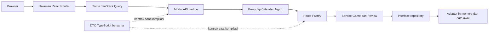

# Game Review

[English](README.md) | Bahasa Indonesia

## 1. Ringkasan

Game Review adalah aplikasi full-stack kecil untuk menelusuri katalog game berisi data awal, membaca ulasan pemain, dan mengirim ulasan yang terdiri dari nama, teks, serta rating 1 sampai 5. Frontend dan backend merupakan aplikasi TypeScript terpisah yang terhubung melalui REST API.

Repositori ini mengutamakan batas tanggung jawab yang eksplisit daripada seremoni framework: React merender pengalaman browser, TanStack Query mengelola server state, Fastify menyediakan endpoint transport, service memuat aturan use case, dan repository yang dapat diganti mengelola persistence. Data sengaja disimpan di memori sehingga tidak memerlukan database eksternal.

## 2. Cakupan Persyaratan

| Persyaratan                              | Implementasi                                                                                                                  |
| ---------------------------------------- | ----------------------------------------------------------------------------------------------------------------------------- |
| Frontend dan backend terpisah            | `apps/web` dan `apps/api` hanya berkomunikasi melalui endpoint REST `/api`.                                                   |
| Model domain Game dan Review             | Modul, service, dan kontrak repository terpisah berada di `apps/api/src/modules`.                                             |
| Data awal                                | Tiga game dan tiga ulasan dimuat ke repository in-memory yang baru.                                                           |
| Menelusuri dan melihat game              | `/` menampilkan daftar game; `/games/:gameId` menampilkan detail dan ulasan.                                                  |
| Mengirim ulasan tervalidasi              | Browser dan API memvalidasi field wajib; service menegakkan panjang setelah trimming serta rating integer 1 sampai 5.         |
| Ulasan terlihat tanpa restart            | Pengirim langsung melihat ulasan yang telah dikonfirmasi server; viewer detail aktif lain melakukan polling setiap dua detik. |
| Verifikasi otomatis                      | Vitest mencakup service/route backend dan perilaku frontend; Playwright mencakup alur pengguna utama.                         |
| Lingkungan reviewer dengan satu perintah | `docker compose up --build` membangun dan menjalankan aplikasi lengkap.                                                       |

## 3. Layar dan Alur Utama

Katalog di `/` menampilkan judul, platform, dan genre setiap game beserta status loading, kegagalan, dan percobaan ulang. Memilih **Lihat detail** membuka `/games/:gameId`, yang menampilkan deskripsi, metadata, ulasan yang ada, serta formulir ulasan yang aksesibel.

Alur utamanya adalah:

1. Buka katalog dan pilih sebuah game.
2. Baca ulasan yang diurutkan dari terbaru.
3. Masukkan nama reviewer dan teks ulasan, lalu pilih rating 1–5 menggunakan mouse atau keyboard.
4. Kirim formulir. Setelah API mengembalikan `201`, ulasan baru dimasukkan ke bagian teratas query cache lokal tanpa memuat ulang halaman.
5. Viewer aktif lain menerima ulasan tersebut pada polling dua detik berikutnya.

## 4. Diagram Arsitektur



Handler HTTP menerjemahkan data transport dan mendelegasikannya ke service. Service memvalidasi invariant domain dan bergantung pada interface repository, bukan detail media penyimpanan. `packages/contracts` membagikan bentuk DTO publik antara browser dan API tanpa mengimpor logika bisnis backend.

## 5. Struktur Proyek

```text
apps/
  api/                 Komposisi Fastify, route, service, repository, dan data awal
    src/modules/       Batas domain Game dan Review
    test/              Test service, repository, server, dan integrasi HTTP
  web/                 Single-page application React/Vite
    src/api/           HTTP client dengan URL relatif dan modul endpoint
    src/queries/       Query key, kebijakan cache, polling, dan mutation
    src/pages/         Route katalog dan detail game
    src/components/    Kartu game, daftar ulasan, formulir, dan kontrol rating
    test/              Test perilaku komponen, client, dan query
packages/contracts/    DTO REST bersama dan envelope error publik
e2e/                   Alur acceptance Playwright
compose.yaml           Lingkungan reviewer lokal lengkap
```

## 6. Mulai Cepat dengan Docker

Prasyarat: Docker dengan Compose v2.

```bash
docker compose up --build
```

Buka <http://localhost:8080>. API juga diekspos di <http://localhost:3000>, sedangkan endpoint liveness tersedia di <http://localhost:3000/health>. Compose menunggu health check API sebelum menjalankan service web. Hentikan dan hapus container dengan:

```bash
docker compose down
```

Image API menjalankan Node.js 24. Image web membangun aplikasi dengan Node.js 24 lalu menyajikan aset statis melalui Nginx, termasuk fallback SPA dan proxy `/api`.

## 7. Pengembangan Lokal

Prasyaratnya adalah Node.js 24 dan Corepack. Field `packageManager` di root mem-pin pnpm 11.19.0.

```bash
corepack enable
corepack pnpm install --frozen-lockfile
pnpm dev
```

Buka <http://localhost:5173>. Vite mem-proxy `/api` ke API di `http://localhost:3000`. Untuk menjalankan salah satu sisi secara terpisah:

```bash
pnpm --filter @game-review/api dev
pnpm --filter @game-review/web dev
```

Jangan simpan secret di repositori. Aplikasi saat ini tidak memerlukan file `.env`; `PORT` dapat digunakan untuk mengubah port API yang secara default bernilai `3000`.

## 8. Menjalankan Pengujian

```bash
pnpm lint       # ESLint dan pemeriksaan Prettier
pnpm typecheck  # pemeriksaan TypeScript strict di setiap package workspace
pnpm test       # seluruh suite Vitest untuk service, HTTP, dan UI
pnpm build      # build production untuk seluruh package
```

Jalankan suite terfokus selama pengembangan:

```bash
pnpm --filter @game-review/api test
pnpm --filter @game-review/web test
```

Instal Chromium satu kali, lalu jalankan acceptance test browser saat port `3000` dan `4173` tersedia:

```bash
pnpm test:e2e:install
pnpm test:e2e
```

Playwright menjalankan proses API dan Vite yang sesungguhnya serta sengaja menolak penggunaan kembali server yang sudah berjalan, sehingga proses lama tidak dapat menghasilkan false positive.

### Git Hook Lokal dan CI

`pnpm install` memasang hook Husky melalui script `prepare`. Sebelum setiap commit, lint-staged menjalankan perbaikan ESLint dan Prettier hanya pada file staged yang didukung; file working tree lain tidak disentuh. Sebelum setiap push, hook menjalankan `pnpm test` dan `pnpm typecheck`. Hook memanggil `corepack pnpm`, sehingga versi pnpm yang digunakan mengikuti versi yang dipin repositori ini.

Playwright sengaja tidak dijalankan oleh hook lokal. Jalankan `pnpm test:e2e` secara eksplisit untuk acceptance release atau melalui workflow CI terpisah. GitHub Actions merupakan gate otoritatif pada setiap push dan pull request serta menjalankan instalasi dependency frozen, lint, typecheck, Vitest, dan build.

Dalam keadaan darurat, `git commit --no-verify` atau `git push --no-verify` dapat melewati hook lokal. **Gunakan hanya untuk membuka hambatan dalam situasi luar biasa: CI dan seluruh gate release tetap wajib, dan pemeriksaan yang dilewati tetap harus dijalankan sebelum integrasi atau release.**

## 9. REST API

| Method | Path                         | Sukses | Tujuan                                |
| ------ | ---------------------------- | ------ | ------------------------------------- |
| `GET`  | `/health`                    | `200`  | Mengembalikan `{ "status": "ok" }`.   |
| `GET`  | `/api/games`                 | `200`  | Menampilkan game dari data awal.      |
| `GET`  | `/api/games/:gameId`         | `200`  | Mengembalikan satu game.              |
| `GET`  | `/api/games/:gameId/reviews` | `200`  | Menampilkan ulasan dari yang terbaru. |
| `POST` | `/api/games/:gameId/reviews` | `201`  | Memvalidasi dan membuat ulasan.       |

Contoh request:

```bash
curl -X POST http://localhost:3000/api/games/elden-ring/reviews \
  -H 'content-type: application/json' \
  -d '{"reviewerName":"Raka","text":"Exploration feels rewarding.","rating":5}'
```

`reviewerName` harus berisi 1–80 karakter setelah trimming, `text` 1–2000 karakter, dan `rating` harus berupa integer 1 sampai 5. ID game yang tidak dikenal menghasilkan `GAME_NOT_FOUND`, request yang tidak valid menghasilkan `VALIDATION_ERROR`, route yang tidak dikenal menghasilkan `NOT_FOUND`, dan kegagalan tidak terduga menghasilkan envelope `INTERNAL_ERROR` yang telah disanitasi.

## 10. Keputusan Arsitektur

### Node.js 24 LTS vs Bun

- **Kasus penggunaan / persyaratan:** Runtime backend yang dapat direproduksi dan dapat diinstal atau dibangun reviewer di Docker dengan sesedikit mungkin kejutan.
- **Keputusan:** Gunakan Node.js 24 LTS yang dipin melalui `engines`, `.nvmrc`, dan kedua Dockerfile.
- **Mengapa sesuai untuk proyek ini:** Assessment ini dioptimalkan untuk reproduktibilitas evaluator, dukungan Fastify/Node yang matang, perilaku test/build yang konvensional, dan sesedikit mungkin variabel khusus lingkungan.
- **Alternatif yang dipertimbangkan:** Bun, yang mampu dan menarik berkat tooling terintegrasi serta kecepatan runtime-nya.
- **Mengapa alternatif belum dipilih:** Kecepatan runtime dan instalasi hanya memberi sedikit manfaat praktis pada skala ini dibanding menjaga alur evaluator tetap konvensional. Bun tidak dianggap lebih buruk atau tidak aman.
- **Kapan keputusan perlu ditinjau ulang:** Bun akan dipertimbangkan kembali ketika tooling terintegrasi atau performa runtime memberi manfaat terukur dalam lingkungan deployment yang terkendali.

### React + Vite vs Next.js

- **Kasus penggunaan / persyaratan:** Client responsif untuk alur katalog dan ulasan yang mengonsumsi REST API terpisah.
- **Keputusan:** Gunakan React dengan Vite dan React Router.
- **Mengapa sesuai untuk proyek ini:** Feedback pengembangan/build yang cepat dan batas SPA/API yang eksplisit sesuai dengan kebutuhan tanpa menambahkan lapisan server rendering.
- **Alternatif yang dipertimbangkan:** Next.js beserta routing, server rendering, dan konvensi full-stack-nya.
- **Mengapa alternatif belum dipilih:** SSR, rendering khusus SEO, dan fitur server framework bukan persyaratan serta akan menduplikasi backend yang sengaja dipisahkan.
- **Kapan keputusan perlu ditinjau ulang:** Tinjau kembali jika visibilitas publik, performa server-rendered, atau fitur React server menjadi persyaratan produk.

### TanStack Query vs native fetch/custom hooks

- **Kasus penggunaan / persyaratan:** Mengoordinasikan loading, error, caching, pembaruan mutation, retry, dan polling terbatas lintas layar.
- **Keputusan:** Tempatkan server state di TanStack Query dan pertahankan pemanggilan HTTP di balik modul API kecil.
- **Mengapa sesuai untuk proyek ini:** Query key stabil, polling sesuai lifecycle observer, cancellation, kebijakan retry, dan pembaruan cache setelah mutation menjadi eksplisit serta dapat diuji.
- **Alternatif yang dipertimbangkan:** `fetch` langsung di komponen atau fetching hook buatan sendiri.
- **Mengapa alternatif belum dipilih:** Keduanya mengharuskan pembuatan ulang lifecycle cache dan perilaku concurrency yang sudah diekspresikan TanStack Query secara konsisten.
- **Kapan keputusan perlu ditinjau ulang:** Hapus untuk UI statis atau satu request; tinjau ulang kebijakan cache jika aplikasi memakai pembaruan streaming atau dataset yang jauh lebih besar.

### React local state vs Redux/Zustand

- **Kasus penggunaan / persyaratan:** Mengelola field formulir ulasan dan pesan validasi sementara sekaligus membagikan data server.
- **Keputusan:** Pertahankan state formulir/UI sementara secara lokal di komponen React; tempatkan data server di TanStack Query.
- **Mengapa sesuai untuk proyek ini:** Tidak ada masalah shared client-state yang berarti. Setiap formulir memiliki pemilik yang jelas, sedangkan data query sudah dibagikan melalui query cache.
- **Alternatif yang dipertimbangkan:** Redux dan Zustand telah dipertimbangkan tetapi sengaja tidak disertakan.
- **Mengapa alternatif belum dipilih:** Menambahkan store hanya untuk menunjukkan pemahaman akan memperluas permukaan konseptual tanpa menyelesaikan persyaratan apa pun.
- **Kapan keputusan perlu ditinjau ulang:** Tambahkan client store ketika muncul workflow client-only lintas bagian, seperti draft multiskrin, state sesi yang kompleks, atau riwayat undo.

### Fastify vs Express/NestJS

- **Kasus penggunaan / persyaratan:** REST API kecil dan bertipe dengan lifecycle yang terprediksi, pemetaan error, pengujian injection, dan sedikit seremoni.
- **Keputusan:** Gunakan Fastify dengan plugin route serta service/repository yang dikonstruksi terpisah.
- **Mengapa sesuai untuk proyek ini:** Fastify menyediakan model plugin yang terfokus, pengujian `inject()` kelas satu, dan batas production server yang jelas.
- **Alternatif yang dipertimbangkan:** Express untuk routing minimal dan NestJS sebagai application framework lengkap.
- **Mengapa alternatif belum dipilih:** Express memerlukan lebih banyak konvensi lokal untuk batas test/error yang sama; NestJS menambah seremoni modul dan dependency injection melebihi kebutuhan aplikasi ini.
- **Kapan keputusan perlu ditinjau ulang:** Pertimbangkan Express untuk menyesuaikan ekosistem yang sudah ada, atau NestJS saat tim besar mendapat manfaat dari modul dan infrastruktur lintas bagian yang terstandar.

### Zod vs Fastify JSON Schema/TypeBox

- **Kasus penggunaan / persyaratan:** Memvalidasi payload ulasan saat runtime dan mengembalikan masalah field yang terstruktur.
- **Keputusan:** Parse input HTTP dengan Zod dan ulangi invariant penting di batas service.
- **Mengapa sesuai untuk proyek ini:** Schema-nya ringkas, menghasilkan path/pesan yang berguna, dan menjaga pemanggilan service tetap aman bahkan dari luar HTTP.
- **Alternatif yang dipertimbangkan:** Fastify JSON Schema dengan TypeBox untuk validasi, typing, dan kemungkinan manfaat serialisasi berbasis schema.
- **Mengapa alternatif belum dipilih:** API hanya memiliki satu payload tulis, sehingga lapisan schema/type lain menambah setup tanpa manfaat berarti.
- **Kapan keputusan perlu ditinjau ulang:** Tinjau kembali ketika generasi OpenAPI, banyak endpoint, serialisasi response, atau penggunaan schema lintas client menjadi penting.

### Repository in-memory vs SQLite/PostgreSQL

- **Kasus penggunaan / persyaratan:** Menyediakan data awal dan menerima ulasan baru tanpa database eksternal.
- **Keputusan:** Gunakan interface repository yang didukung adapter in-memory dengan defensive copy.
- **Mengapa sesuai untuk proyek ini:** Startup deterministik, setup reviewer tidak memerlukan migrasi, dan service tetap independen dari teknologi penyimpanan berikutnya.
- **Alternatif yang dipertimbangkan:** SQLite untuk persistence lokal dan PostgreSQL untuk concurrency serta durability production.
- **Mengapa alternatif belum dipilih:** Persistence eksternal secara eksplisit berada di luar scope; keduanya menambahkan schema, migrasi, dan kebutuhan operasional yang tidak diperlukan untuk menunjukkan use case.
- **Kapan keputusan perlu ditinjau ulang:** Ganti adapter ketika ulasan harus bertahan setelah restart, beberapa instance API harus berbagi data, atau kebutuhan query/pagination bertambah.

### Vitest + RTL + Fastify inject + Playwright

- **Kasus penggunaan / persyaratan:** Feedback cepat untuk perilaku domain, kontrak HTTP, perilaku browser, dan satu perjalanan end-to-end utama.
- **Keputusan:** Gunakan Vitest untuk test package, React Testing Library untuk perilaku UI yang terlihat pengguna, Fastify `inject()` untuk integrasi HTTP, dan Playwright untuk acceptance dari menelusuri sampai mengirim ulasan.
- **Mengapa sesuai untuk proyek ini:** Sebagian besar kegagalan dapat diisolasi cepat tanpa proses jaringan, sedangkan satu alur browser nyata memverifikasi aplikasi yang telah dirakit dapat berkomunikasi dengan benar.
- **Alternatif yang dipertimbangkan:** Jest, pengujian hanya melalui browser, atau suite Playwright yang lebih besar.
- **Mengapa alternatif belum dipilih:** Jest menambah toolchain kedua; test browser saja lebih lambat dan kurang diagnostik; cakupan E2E yang luas menduplikasi test perilaku yang lebih murah.
- **Kapan keputusan perlu ditinjau ulang:** Perluas Playwright untuk perjalanan lintas service berisiko tinggi, dan tambahkan threshold coverage hanya setelah tim menyepakati target berbasis risiko yang bermanfaat.

### Docker Compose

- **Kasus penggunaan / persyaratan:** Membangun dan menjalankan seluruh sistem dengan satu perintah reviewer.
- **Keputusan:** Bangun image API dan web multi-stage yang terpisah serta orkestrasi keduanya dengan Docker Compose.
- **Mengapa sesuai untuk proyek ini:** Compose merekam versi runtime, jaringan, urutan berdasarkan health API, fallback SPA Nginx, dan proxy API same-origin dalam alur yang dapat direproduksi.
- **Alternatif yang dipertimbangkan:** Script host saja, satu container gabungan, atau orkestrator cluster seperti Kubernetes.
- **Mengapa alternatif belum dipilih:** Script host membuka lebih banyak variasi mesin, image gabungan mengaburkan batas deployment, dan orkestrasi cluster terlalu besar untuk dua service lokal.
- **Kapan keputusan perlu ditinjau ulang:** Gunakan orkestrasi khusus deployment ketika scaling production, secret, rolling release, atau kebijakan health terkelola dibutuhkan.

### Antrean dan Redis

- **Kasus penggunaan / persyaratan:** Membuat ulasan melalui alur request/response sinkron dan membuatnya terlihat dalam deployment in-memory satu proses.
- **Keputusan:** Jangan tambahkan message queue atau Redis untuk scope saat ini.
- **Mengapa sesuai untuk proyek ini:** Pembuatan ulasan selesai dalam satu request API. Tidak ada background job durable, retry asinkron, backpressure, koordinasi antar-instance, atau tekanan cache yang perlu diselesaikan.
- **Alternatif yang dipertimbangkan:** Redis untuk distributed cache, rate limiting, atau session, serta durable queue untuk pemrosesan background.
- **Mengapa alternatif belum dipilih:** Keduanya menambah kompleksitas deployment, failure mode, monitoring, dan lifecycle data tanpa menyelesaikan persyaratan saat ini.
- **Kapan keputusan perlu ditinjau ulang:** Tinjau kembali ketika sistem memerlukan background work durable, kontrol retry/backpressure, koordinasi multi-instance, distributed cache/rate limiting/session, atau beban terukur yang membenarkan biaya operasionalnya.

## 11. Strategi Pengujian

Pengembangan mengikuti TDD red-green-refactor. Test service melindungi aturan bisnis dan isolasi repository; test integrasi Fastify melindungi status, DTO, persistence dalam satu proses, serta envelope error yang disanitasi. React Testing Library mencakup status loading/error/sukses yang terlihat, validasi, pemilihan rating dengan keyboard, race pada cache, dan lifecycle polling. Playwright memverifikasi alur katalog → detail → kirim → ulasan tersimpan terhadap server nyata tanpa memuat ulang halaman.

Release gate utama adalah `pnpm lint`, `pnpm typecheck`, `pnpm test`, dan `pnpm build`. Alur E2E merupakan acceptance check terpisah dengan biaya lebih tinggi. Saat ini tidak ada target line coverage arbitrer; test dipilih berdasarkan persyaratan, batas sistem, jalur kegagalan, dan regresi, bukan detail implementasi.

## 12. Asumsi

- Ini adalah aplikasi assessment satu proses dengan dataset kecil dan tepercaya serta tanpa sistem akun.
- Visibilitas ulasan bagi pengguna lain dapat terlambat sampai dua detik; polling hanya berjalan ketika query detail memiliki observer aktif dan tidak berlanjut di tab background.
- POST yang sukses merupakan sumber kebenaran. Cache pengirim baru diperbarui setelah server merespons, kemudian polling berikutnya merekonsiliasikannya dengan state server.
- Request browser memakai path relatif `/api`; Vite menanganinya secara lokal dan Nginx menanganinya di Docker.
- Data awal dibuat ulang setiap kali proses aplikasi baru dimulai.

## 13. Kompromi

- Persistence in-memory memberi reproduktibilitas tanpa setup, tetapi tidak memiliki durability atau horizontal scaling.
- Polling dua detik sederhana dan terbatas, tetapi menghasilkan read berulang serta bukan real-time sesungguhnya.
- Validasi runtime pada batas route dan service menduplikasi beberapa aturan, tetapi menjaga keamanan domain bagi caller non-HTTP.
- DTO TypeScript bersama mencegah banyak ketidakcocokan saat kompilasi, tetapi tidak menghasilkan runtime client atau menjamin service yang di-deploy terpisah cocok dengan versi client.
- Penyisipan cache langsung memberi feedback responsif setelah submit, tetapi concurrency tetap membutuhkan cancellation dan deduplikasi berbasis ID agar hasil GET lama tidak menggantikan ulasan baru.
- SPA yang terfokus menghindari kompleksitas SSR, tetapi tidak mengoptimalkan SEO publik atau rendering response pertama.

## 14. Peningkatan Jika Ada Lebih Banyak Waktu

1. Tambahkan adapter SQLite atau PostgreSQL, migrasi, pagination, dan test integrasi terhadap database terpilih.
2. Ganti polling dengan server-sent events untuk pembaruan ulasan berlatensi lebih rendah sambil mempertahankan rekonsiliasi query cache.
3. Tambahkan autentikasi, ownership, moderasi, rate limiting, dan kontrol penyalahgunaan sebelum menerima konten publik.
4. Hasilkan dokumentasi OpenAPI dan typed client dari runtime schema untuk memperkuat pemeriksaan kontrak saat deployment.
5. Tambahkan structured log, korelasi request, metric, production readiness probe, dan pelaporan error.
6. Perluas Playwright untuk skenario kegagalan/retry dan multi-viewer, ditambah pemeriksaan aksesibilitas otomatis dan visual regression.
7. Tambahkan deployment smoke test, pemeriksaan dependency terjadwal, dan workflow release E2E yang dipicu terpisah ketika biaya runtime-nya dapat dibenarkan.

## 15. Keterbatasan yang Diketahui

- Ulasan hilang saat API restart dan tidak dibagikan di antara beberapa proses API.
- Tidak ada autentikasi, otorisasi, moderasi, alur edit/hapus, atau perlindungan duplikasi/spam.
- Ulasan tidak memiliki pagination, skor agregat, pencarian, kontrol urutan, atau perilaku refresh yang dapat dikonfigurasi pengguna.
- Viewer lain menerima pembaruan melalui polling dengan keterlambatan foreground sampai dua detik dan tanpa refresh di tab background.
- UI sengaja memakai katalog ringkas tanpa artwork game, sistem lokalisasi, dukungan offline, atau SSR.
- Docker Compose merupakan lingkungan lokal yang dapat direproduksi, bukan spesifikasi deployment production.
