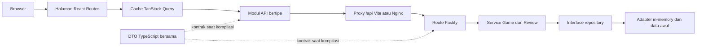

# Game Review

[English](README.en.md) | Bahasa Indonesia

Selamat datang. Ini aplikasi full-stack kecil untuk menelusuri katalog game, membaca ulasan pemain, dan menulis ulasan sendiri. README ini menemani kamu dari nol sampai aplikasinya jalan, sekaligus bercerita kenapa tiap keputusan teknis diambil.

## Mulai Cepat untuk Reviewer

Tiga baris, dari repositori kosong sampai aplikasi jalan:

```bash
git clone https://github.com/barayuda/monorepo-game-review.git
cd monorepo-game-review
docker compose up --build
```

Lalu buka <http://localhost:8080>. Butuh detail prasyarat, URL tiap service, dan cara mematikannya? Lompat ke [Mulai Cepat dengan Docker](#6-mulai-cepat-dengan-docker).

## 1. Ringkasan

Game Review adalah aplikasi full-stack kecil untuk menelusuri katalog game berisi data awal, membaca ulasan pemain, dan mengirim ulasan yang terdiri dari nama, teks, serta rating 1 sampai 5. Frontend dan backend-nya dua aplikasi TypeScript terpisah yang ngobrol lewat REST API.

Prinsipnya sederhana: batas tanggung jawab yang jelas lebih berharga daripada seremoni framework. React mengurus tampilan, TanStack Query memegang server state, Fastify menyediakan endpoint, service menyimpan aturan use case, dan repository yang gampang diganti mengurus penyimpanan. Datanya sengaja ditaruh di memori, jadi kamu tidak perlu menyiapkan database apa pun.

## 2. Cakupan Persyaratan

Semua yang diminta, beserta tempat kamu bisa mengeceknya sendiri:

| Persyaratan                              | Implementasi                                                                                                                                                                                                         |
| ---------------------------------------- | -------------------------------------------------------------------------------------------------------------------------------------------------------------------------------------------------------------------- |
| Frontend dan backend terpisah            | `apps/web` dan `apps/api` hanya berkomunikasi melalui endpoint REST `/api`.                                                                                                                                          |
| Model domain Game dan Review             | Modul, service, dan kontrak repository terpisah berada di `apps/api/src/modules`.                                                                                                                                    |
| Data awal                                | Sembilan belas game peraih dan nominasi Game of the Year beserta 26 ulasan dimuat ke repository in-memory yang baru; satu game sengaja tanpa ulasan agar empty state terlihat. Setiap game membawa URL sampul resmi. |
| Menelusuri dan melihat game              | `/` menampilkan daftar game; `/games/:gameId` menampilkan detail dan ulasan.                                                                                                                                         |
| Mengirim ulasan tervalidasi              | Browser dan API memvalidasi field wajib; service menegakkan panjang setelah trimming serta rating integer 1 sampai 5.                                                                                                |
| Ulasan terlihat tanpa restart            | Pengirim langsung melihat ulasan yang sudah dikonfirmasi server; viewer detail aktif lain menyusul lewat polling dua detik.                                                                                          |
| Verifikasi otomatis                      | Vitest mencakup service/route backend dan perilaku frontend; Playwright mencakup alur pengguna utama.                                                                                                                |
| Lingkungan reviewer dengan satu perintah | `docker compose up --build` membangun dan menjalankan aplikasi lengkap.                                                                                                                                              |

## 3. Layar dan Alur Utama

Katalog di `/` menampilkan judul, platform, dan genre tiap game, lengkap dengan status loading, kegagalan, dan tombol coba lagi. Klik **Lihat detail** dan kamu masuk ke `/games/:gameId`, yang memuat deskripsi, metadata, ulasan yang sudah ada, dan formulir ulasan yang ramah keyboard maupun pembaca layar.

Alurnya begini:

1. Buka katalog, pilih satu game.
2. Baca ulasan yang tersusun dari yang terbaru.
3. Isi nama reviewer dan teks ulasan, lalu pilih rating 1–5 pakai mouse atau keyboard.
4. Kirim. Begitu API membalas `201`, ulasan baru langsung nangkring di posisi teratas tanpa halaman dimuat ulang.
5. Viewer aktif lain ikut melihatnya pada polling dua detik berikutnya.

## 4. Diagram Arsitektur



Singkatnya: handler HTTP cuma menerjemahkan data transport lalu menyerahkannya ke service. Service memvalidasi invariant domain dan bergantung pada interface repository, bukan pada detail media penyimpanan. `packages/contracts` membagikan bentuk DTO publik antara browser dan API tanpa ikut membawa logika bisnis backend.

## 5. Struktur Proyek

```text
apps/
  api/                 Komposisi Fastify, route, service, repository, dan data awal
    src/modules/       Batas domain Game dan Review
    test/              Test service, repository, server, dan integrasi HTTP
  web/                 Single-page application React/Vite
    src/api/           HTTP client dengan URL relatif dan modul endpoint
    src/queries/       Query key, kebijakan cache, polling, dan mutation
    src/pages/         Route katalog dan detail game
    src/components/    Kartu game, daftar ulasan, formulir, dan kontrol rating
    test/              Test perilaku komponen, client, dan query
packages/contracts/    DTO REST bersama dan envelope error publik
e2e/                   Alur acceptance Playwright
compose.yaml           Lingkungan reviewer lokal lengkap
```

## 6. Mulai Cepat dengan Docker

Yang kamu butuhkan cuma Git dan Docker dengan Compose v2.

```bash
git clone https://github.com/barayuda/monorepo-game-review.git
cd monorepo-game-review
docker compose up --build
```

Buka <http://localhost:8080>. API-nya juga terbuka di <http://localhost:3000>, dan endpoint liveness-nya ada di <http://localhost:3000/health>. Compose sabar menunggu health check API lulus sebelum menyalakan service web, jadi kamu tidak akan kebagian layar error karena urutan startup.

Kalau sudah selesai:

```bash
docker compose down
```

Image API jalan di Node.js 24. Image web dibangun dengan Node.js 24 lalu menyajikan aset statis lewat Nginx, termasuk fallback SPA dan proxy `/api`.

## 7. Pengembangan Lokal

Siapkan Node.js 24 dan Corepack. Versi pnpm-nya sudah dipin di field `packageManager` root, yaitu pnpm 11.19.0, jadi kamu tidak perlu menebak-nebak.

```bash
corepack enable
corepack pnpm install --frozen-lockfile
pnpm dev
```

Buka <http://localhost:5173>. Vite otomatis mem-proxy `/api` ke API di `http://localhost:3000`.

Mau menyalakan satu sisi saja? Bisa:

```bash
pnpm --filter @game-review/api dev
pnpm --filter @game-review/web dev
```

Satu catatan penting: jangan simpan secret di repositori. Aplikasi ini memang tidak butuh file `.env` sama sekali; kalau perlu memindahkan port API, cukup pakai `PORT` yang defaultnya `3000`.

## 8. Menjalankan Pengujian

Lima perintah ini adalah gerbang utamanya:

```bash
pnpm lint           # ESLint dan pemeriksaan Prettier
pnpm typecheck      # pemeriksaan TypeScript strict di setiap package workspace
pnpm test           # seluruh suite Vitest untuk service, HTTP, dan UI
pnpm test:coverage  # suite yang sama, dengan ambang coverage 100% ditegakkan
pnpm build          # build production untuk seluruh package
```

Selama ngoding, biasanya kamu cuma butuh suite yang sedang dikerjakan:

```bash
pnpm --filter @game-review/api test
pnpm --filter @game-review/web test
```

Untuk acceptance test browser, instal Chromium sekali saja, lalu pastikan port `3000` dan `4173` sedang kosong:

```bash
pnpm test:e2e:install
pnpm test:e2e
```

Playwright sengaja menyalakan proses API dan Vite yang sebenarnya, dan menolak memakai ulang server yang sudah jalan. Sedikit lebih lambat, tapi kamu terhindar dari false positive gara-gara proses lama yang masih nyangkut.

### Git Hook Lokal dan CI

`pnpm install` memasang hook Husky lewat script `prepare`. Sebelum tiap commit, lint-staged menjalankan perbaikan ESLint dan Prettier hanya pada file staged yang didukung, jadi file lain di working tree kamu aman. Sebelum tiap push, hook menjalankan `pnpm test` lalu `pnpm typecheck`. Semua hook memanggil `corepack pnpm` supaya versi pnpm-nya konsisten dengan yang dipin repositori ini.

Playwright sengaja tidak ikut di hook lokal supaya commit dan push tetap terasa ringan. Jalankan `pnpm test:e2e` secara eksplisit saat acceptance release atau lewat workflow CI terpisah. GitHub Actions tetap jadi gate otoritatif di tiap push dan pull request, menjalankan instalasi dependency frozen, lint, typecheck, Vitest, ambang coverage, dan build.

Kalau benar-benar mentok, `git commit --no-verify` atau `git push --no-verify` bisa melewati hook lokal. **Tapi ini betul-betul pintu darurat: CI dan seluruh gate release tetap wajib, dan pemeriksaan yang dilewati harus dijalankan sebelum integrasi atau release.**

## 9. REST API

| Method | Path                         | Sukses | Tujuan                                |
| ------ | ---------------------------- | ------ | ------------------------------------- |
| `GET`  | `/health`                    | `200`  | Mengembalikan `{ "status": "ok" }`.   |
| `GET`  | `/api/games`                 | `200`  | Menampilkan game dari data awal.      |
| `GET`  | `/api/games/:gameId`         | `200`  | Mengembalikan satu game.              |
| `GET`  | `/api/games/:gameId/reviews` | `200`  | Menampilkan ulasan dari yang terbaru. |
| `POST` | `/api/games/:gameId/reviews` | `201`  | Memvalidasi dan membuat ulasan.       |

Mau coba langsung? Silakan:

```bash
curl -X POST http://localhost:3000/api/games/elden-ring/reviews \
  -H 'content-type: application/json' \
  -d '{"reviewerName":"Raka","text":"Exploration feels rewarding.","rating":5}'
```

Setiap game membawa `id`, `title`, `description`, `genre`, `platform`, `developer`, dan `releaseYear`. Game yang masuk daftar Game of the Year juga membawa `awardYear` dan `awardRank`; rank 1 berarti pemenang tahun itu, sedangkan 2 dan 3 adalah nominasi tahun yang sama yang diurutkan oleh katalog ini, karena The Game Awards tidak mengumumkan juara dua dan tiga.

Aturan validasinya: `reviewerName` harus 1–80 karakter setelah trimming, `text` 1–2000 karakter, dan `rating` wajib integer 1 sampai 5. Kalau ada yang meleset, API menjawab dengan envelope yang konsisten: ID game tak dikenal jadi `GAME_NOT_FOUND`, request tidak valid jadi `VALIDATION_ERROR`, route tak dikenal jadi `NOT_FOUND`, kegagalan request 4xx lain seperti media type yang tidak didukung jadi `BAD_REQUEST` dengan status aslinya, dan kegagalan tak terduga jadi `INTERNAL_ERROR` yang sudah disanitasi, jadi pesan internal tidak pernah bocor ke client.

## 10. Keputusan Arsitektur

Bagian ini menjawab pertanyaan "kenapa ini, bukan itu?" untuk tiap teknologi besar. Formatnya sengaja seragam supaya gampang dibandingkan.

### Node.js 24 LTS vs Bun

- **Kebutuhannya:** runtime backend yang bisa direproduksi dan gampang dipasang atau dibangun reviewer di Docker, tanpa kejutan.
- **Pilihan:** Node.js 24 LTS, dipin lewat `engines`, `.nvmrc`, dan kedua Dockerfile.
- **Kenapa cocok di sini:** proyek ini dioptimalkan untuk reproduktibilitas evaluator, dukungan Fastify/Node yang sudah matang, perilaku test/build yang konvensional, dan sesedikit mungkin variabel khusus lingkungan.
- **Alternatif yang dilirik:** Bun, yang jujurnya menarik berkat tooling terintegrasi dan kecepatan runtime-nya.
- **Kenapa belum dipilih:** di skala sekecil ini, kecepatan runtime dan instalasi tidak memberi keuntungan praktis sebesar menjaga alur evaluator tetap konvensional. Bun sama sekali tidak dianggap lebih buruk atau kurang aman.
- **Kapan perlu ditinjau lagi:** saat tooling terintegrasi atau performa runtime memberi manfaat terukur di lingkungan deployment yang terkendali.

### React + Vite vs Next.js

- **Kebutuhannya:** client responsif untuk alur katalog dan ulasan yang mengonsumsi REST API terpisah.
- **Pilihan:** React dengan Vite dan React Router.
- **Kenapa cocok di sini:** feedback development dan build-nya cepat, dan batas SPA/API tetap eksplisit tanpa menambah lapisan server rendering.
- **Alternatif yang dilirik:** Next.js dengan routing, server rendering, dan konvensi full-stack-nya.
- **Kenapa belum dipilih:** SSR, rendering khusus SEO, dan fitur server framework bukan persyaratan, dan malah akan menduplikasi backend yang sengaja dipisah.
- **Kapan perlu ditinjau lagi:** kalau visibilitas publik, performa server-rendered, atau fitur React server jadi kebutuhan produk.

### TanStack Query vs native fetch/custom hooks

- **Kebutuhannya:** mengoordinasikan loading, error, caching, pembaruan setelah mutation, retry, dan polling terbatas lintas layar.
- **Pilihan:** server state ditaruh di TanStack Query, panggilan HTTP disembunyikan di balik modul API kecil.
- **Kenapa cocok di sini:** query key stabil, polling yang mengikuti lifecycle observer, cancellation, kebijakan retry, dan pembaruan cache pasca-mutation jadi eksplisit sekaligus bisa diuji.
- **Alternatif yang dilirik:** `fetch` langsung di komponen, atau fetching hook buatan sendiri.
- **Kenapa belum dipilih:** dua-duanya berujung membangun ulang lifecycle cache dan perilaku concurrency yang sudah diekspresikan TanStack Query secara konsisten.
- **Kapan perlu ditinjau lagi:** buang saja kalau UI-nya statis atau cuma satu request; tinjau ulang kebijakan cache kalau aplikasi beralih ke pembaruan streaming atau dataset yang jauh lebih besar.

### React local state vs Redux/Zustand

- **Kebutuhannya:** mengelola field formulir ulasan dan pesan validasi sementara, sambil tetap berbagi data server.
- **Pilihan:** state formulir/UI sementara tinggal di komponen React; data server tinggal di TanStack Query.
- **Kenapa cocok di sini:** tidak ada masalah shared client-state yang benar-benar nyata. Tiap formulir punya pemilik yang jelas, sedangkan data query sudah dibagikan lewat query cache.
- **Alternatif yang dilirik:** Redux dan Zustand, keduanya dipertimbangkan lalu sengaja tidak dipakai.
- **Kenapa belum dipilih:** menambah store cuma demi memamerkan keakraban akan memperluas permukaan konseptual tanpa menyelesaikan persyaratan apa pun.
- **Kapan perlu ditinjau lagi:** begitu muncul workflow client-only yang benar-benar lintas bagian, misalnya draft multiskrin, state sesi yang rumit, atau riwayat undo.

### Fastify vs Express/NestJS

- **Kebutuhannya:** REST API kecil dan bertipe dengan lifecycle yang terprediksi, pemetaan error rapi, pengujian injection, dan sedikit seremoni.
- **Pilihan:** Fastify dengan plugin route serta service/repository yang dikonstruksi terpisah.
- **Kenapa cocok di sini:** model plugin-nya fokus, `inject()` untuk testing kelas satu, dan batas production server-nya jelas.
- **Alternatif yang dilirik:** Express untuk routing minimal, dan NestJS sebagai application framework lengkap.
- **Kenapa belum dipilih:** Express butuh lebih banyak konvensi lokal untuk mencapai batas test/error yang sama; NestJS membawa seremoni modul dan dependency injection yang melampaui kebutuhan aplikasi ini.
- **Kapan perlu ditinjau lagi:** Express kalau harus menyesuaikan ekosistem yang sudah ada, atau NestJS saat tim besar diuntungkan modul dan infrastruktur lintas bagian yang terstandar.

### Zod vs Fastify JSON Schema/TypeBox

- **Kebutuhannya:** memvalidasi payload ulasan saat runtime dan mengembalikan masalah field yang terstruktur.
- **Pilihan:** parse input HTTP dengan Zod, lalu ulangi invariant pentingnya di batas service.
- **Kenapa cocok di sini:** schema-nya ringkas, path dan pesannya berguna, dan pemanggilan service tetap aman bahkan dari luar HTTP.
- **Alternatif yang dilirik:** Fastify JSON Schema dengan TypeBox, untuk validasi, typing, dan kemungkinan manfaat serialisasi berbasis schema.
- **Kenapa belum dipilih:** API ini cuma punya satu payload tulis, jadi lapisan schema/type tambahan hanya menambah setup tanpa manfaat berarti.
- **Kapan perlu ditinjau lagi:** saat generasi OpenAPI, banyak endpoint, serialisasi response, atau pemakaian schema lintas client mulai penting.

### Repository in-memory vs SQLite/PostgreSQL

- **Kebutuhannya:** menyediakan data awal dan menerima ulasan baru tanpa database eksternal.
- **Pilihan:** interface repository yang didukung adapter in-memory dengan defensive copy.
- **Kenapa cocok di sini:** startup-nya deterministik, reviewer tidak perlu menjalankan migrasi, dan service tetap independen dari teknologi penyimpanan berikutnya.
- **Alternatif yang dilirik:** SQLite untuk persistence lokal, PostgreSQL untuk concurrency dan durability production.
- **Kenapa belum dipilih:** persistence eksternal memang di luar scope, dan keduanya membawa schema, migrasi, serta kebutuhan operasional yang tidak diperlukan untuk menunjukkan use case-nya.
- **Kapan perlu ditinjau lagi:** ganti adapter-nya begitu ulasan harus bertahan setelah restart, beberapa instance API harus berbagi data, atau kebutuhan query/pagination bertambah.

### Vitest + RTL + Fastify inject + Playwright

- **Kebutuhannya:** feedback cepat untuk perilaku domain, kontrak HTTP, perilaku browser, dan satu perjalanan end-to-end utama.
- **Pilihan:** Vitest untuk test package, React Testing Library untuk perilaku UI yang terlihat pengguna, Fastify `inject()` untuk integrasi HTTP, dan Playwright untuk acceptance dari menelusuri sampai mengirim ulasan.
- **Kenapa cocok di sini:** mayoritas kegagalan terisolasi cepat tanpa proses jaringan, sementara satu alur browser sungguhan memastikan kedua aplikasi benar-benar nyambung.
- **Alternatif yang dilirik:** Jest, pengujian lewat browser saja, atau suite Playwright yang jauh lebih besar.
- **Kenapa belum dipilih:** Jest menambah toolchain kedua; test browser saja lebih lambat dan kurang diagnostik; cakupan E2E yang luas cuma menduplikasi test perilaku yang lebih murah.
- **Kapan perlu ditinjau lagi:** perluas Playwright untuk perjalanan lintas service yang berisiko tinggi, dan tambahkan threshold coverage hanya setelah tim menyepakati target berbasis risiko yang benar-benar berguna.

### Docker Compose

- **Kebutuhannya:** membangun dan menjalankan seluruh sistem dengan satu perintah reviewer.
- **Pilihan:** image API dan web multi-stage yang terpisah, diorkestrasi Docker Compose.
- **Kenapa cocok di sini:** Compose merekam versi runtime, jaringan, urutan berdasarkan health API, fallback SPA Nginx, dan proxy API same-origin dalam satu alur yang bisa direproduksi.
- **Alternatif yang dilirik:** script host saja, satu container gabungan, atau orkestrator cluster seperti Kubernetes.
- **Kenapa belum dipilih:** script host membuka lebih banyak variasi mesin, image gabungan mengaburkan batas deployment, dan orkestrasi cluster jelas berlebihan untuk dua service lokal.
- **Kapan perlu ditinjau lagi:** pakai orkestrasi khusus deployment begitu scaling production, secret, rolling release, atau kebijakan health terkelola dibutuhkan.

### Antrean dan Redis

- **Kebutuhannya:** membuat ulasan lewat alur request/response sinkron dan menampilkannya di deployment in-memory satu proses.
- **Pilihan:** tidak menambahkan message queue maupun Redis untuk scope saat ini.
- **Kenapa cocok di sini:** pembuatan ulasan selesai dalam satu request API. Tidak ada background job durable, retry asinkron, backpressure, koordinasi antar-instance, atau tekanan cache yang perlu diselesaikan.
- **Alternatif yang dilirik:** Redis untuk distributed cache, rate limiting, atau session; plus durable queue untuk pemrosesan background.
- **Kenapa belum dipilih:** keduanya menambah kompleksitas deployment, failure mode, monitoring, dan lifecycle data tanpa menyelesaikan satu pun kebutuhan saat ini.
- **Kapan perlu ditinjau lagi:** begitu sistem butuh background work durable, kontrol retry/backpressure, koordinasi multi-instance, distributed cache/rate limiting/session, atau beban terukur yang membenarkan biaya operasionalnya.

## 11. Strategi Pengujian

Pengembangannya mengikuti TDD red-green-refactor. Test service menjaga aturan bisnis dan isolasi repository; test integrasi Fastify menjaga status, DTO, persistence dalam satu proses, plus envelope error yang sudah disanitasi. React Testing Library menutup status loading/error/sukses yang terlihat, validasi, pemilihan rating lewat keyboard, race pada cache, dan lifecycle polling. Playwright memverifikasi alur katalog → detail → kirim → ulasan tersimpan terhadap server sungguhan, tanpa halaman dimuat ulang.

Gate rilis utamanya `pnpm lint`, `pnpm typecheck`, `pnpm test`, `pnpm test:coverage`, dan `pnpm build`. Alur E2E berdiri sendiri sebagai acceptance check dengan biaya lebih tinggi.

`pnpm test:coverage` menjalankan suite dengan pengukuran coverage, dan `apps/api` maupun `apps/web` saat ini berada di 100% untuk statement, branch, function, dan line, dengan ambang batas yang membuat CI gagal begitu angkanya turun. Angka itu dicapai dengan menguji perilaku dan membuang kode yang ternyata tidak pernah tereksekusi, bukan dengan menambah assertion kosong: dua cabang mati ditemukan justru karena laporan coverage menyorotinya. Coverage di sini diperlakukan sebagai lantai yang menahan regresi, bukan sebagai tujuan; test tetap dipilih berdasarkan persyaratan, batas sistem, jalur kegagalan, dan regresi. Test yang ditulis setelah implementasinya dibuktikan bergigi dengan cara merusak implementasi itu dan memastikan test-nya gagal lebih dulu.

## 12. Asumsi

Supaya kamu tahu persis di lahan seperti apa aplikasi ini berdiri:

- Brief mengizinkan skala rating 1–5 atau 1–10. Dipilih 1–5 karena lima pilihan cukup dibedakan pemain tanpa perlu penjelasan, dan skala tersimpan sebagai integer sehingga menggantinya cukup di satu invariant service plus schema Zod-nya.
- Ini aplikasi assessment satu proses, dengan dataset kecil dan tepercaya, tanpa sistem akun.
- Ulasan bisa telat terlihat pengguna lain sampai dua detik; polling hanya berjalan ketika query detail punya observer aktif, dan berhenti di tab background.
- POST yang sukses adalah sumber kebenaran. Cache pengirim baru diperbarui setelah server merespons, lalu polling berikutnya merekonsiliasikannya dengan state server.
- Request browser memakai path relatif `/api`; Vite menanganinya secara lokal dan Nginx menanganinya di Docker.
- Data awal dibuat ulang tiap kali proses aplikasi baru dimulai.

## 13. Kompromi

Tidak ada keputusan yang gratis. Ini harga yang dibayar:

- Persistence in-memory memberi reproduktibilitas tanpa setup, tapi tidak punya durability maupun horizontal scaling.
- Polling dua detik sederhana dan terkendali, tapi menghasilkan read berulang dan bukan real-time sungguhan.
- Validasi runtime di batas route dan service menduplikasi beberapa aturan, tapi menjaga keamanan domain untuk caller non-HTTP.
- DTO TypeScript bersama mencegah banyak ketidakcocokan saat kompilasi, tapi tidak menghasilkan runtime client dan tidak menjamin service yang di-deploy terpisah cocok dengan versi client.
- Penyisipan cache langsung membuat feedback pasca-submit terasa responsif, tapi concurrency tetap butuh cancellation dan deduplikasi berbasis ID supaya hasil GET lama tidak menimpa ulasan baru.
- SPA yang fokus menghindari kompleksitas SSR, tapi tidak mengoptimalkan SEO publik maupun rendering response pertama.
- Sampul game ditautkan langsung ke Wikimedia, bukan disalin ke repositori: reviewer tidak perlu mengunduh biner dan repositorinya tetap ringan, tapi katalog jadi bergantung pada host pihak ketiga dan host itu harus disebut di `img-src`. Satu test mengikat data awal ke direktif CSP supaya keduanya tidak bisa berbeda diam-diam.

## 14. Peningkatan Jika Ada Lebih Banyak Waktu

Daftar keinginan, terurut dari yang paling berdampak:

1. Tambahkan adapter SQLite atau PostgreSQL, migrasi, pagination, dan test integrasi terhadap database terpilih.
2. Ganti polling dengan server-sent events untuk pembaruan ulasan berlatensi lebih rendah, sambil mempertahankan rekonsiliasi query cache.
3. Tambahkan autentikasi, ownership, moderasi, rate limiting, dan kontrol penyalahgunaan sebelum menerima konten publik.
4. Hasilkan dokumentasi OpenAPI dan typed client dari runtime schema untuk memperkuat pemeriksaan kontrak saat deployment.
5. Tambahkan structured log, korelasi request, metric, production readiness probe, dan pelaporan error.
6. Perluas Playwright untuk skenario kegagalan/retry dan multi-viewer, plus pemeriksaan aksesibilitas otomatis dan visual regression.
7. Tambahkan deployment smoke test, pemeriksaan dependency terjadwal, dan workflow release E2E terpisah begitu biaya runtime-nya sepadan.
8. Tambahkan performance test untuk REST API: tetapkan anggaran latensi p95 dan p99 per endpoint, ukur `GET /api/games` bersama pembacaan dan penulisan ulasan di bawah beban bersamaan memakai k6 atau autocannon, jalankan sebagai gate terpisah dari CI utama, dan catat titik ketika adapter in-memory mulai jadi penghambat.

## 15. Keterbatasan yang Diketahui

Terakhir, dan ini penting: berikut hal-hal yang memang belum ada, supaya tidak ada ekspektasi yang meleset.

- Ulasan hilang saat API restart dan tidak dibagikan di antara beberapa proses API.
- Tidak ada autentikasi, otorisasi, moderasi, alur edit/hapus, atau perlindungan duplikasi/spam.
- Ulasan belum punya pagination, skor agregat, pencarian, kontrol urutan, atau perilaku refresh yang bisa diatur pengguna.
- Viewer lain menerima pembaruan lewat polling, dengan keterlambatan foreground sampai dua detik dan tanpa refresh di tab background.
- UI-nya sengaja ringkas: tanpa sistem lokalisasi, dukungan offline, atau SSR.
- Sampul dimuat dari host eksternal, jadi tanpa koneksi keluar setiap kartu turun ke penanda cadangan berisi inisial judul. Aplikasinya tetap berfungsi penuh.
- Docker Compose di sini adalah lingkungan lokal yang bisa direproduksi, bukan spesifikasi deployment production.

## 16. Deploy ke Render

`render.yaml` mendefinisikan lingkungan demo publik: dua service Docker di region Singapore, memakai Dockerfile yang sama persis dengan yang sudah diverifikasi CI dan Docker Compose. Tidak ada jalur build kedua yang tidak pernah dicoba siapa pun.

Deploy digerakkan CI, bukan oleh push. `autoDeploy` sengaja dimatikan di `render.yaml`, dan job `Deploy to Render` baru berjalan setelah quality gate, acceptance test, dan container build hijau. Artinya kode yang gagal CI tidak pernah sampai ke URL publik.

Dua langkah berikut dikerjakan sekali lewat dashboard Render dan GitHub:

1. Buat Blueprint baru di Render dari repositori ini. Render membaca `render.yaml` lalu membuat kedua service.
2. Salin deploy hook tiap service ke GitHub secret `RENDER_DEPLOY_HOOK_API` dan `RENDER_DEPLOY_HOOK_WEB`. Kalau salah satu belum diisi, job deploy melewati dirinya sendiri alih-alih menggagalkan CI, jadi fork tetap bisa lulus.

Nginx menerima alamat API lewat `API_UPSTREAM`, diturunkan otomatis dari service API di private network Render, sehingga tidak ada URL yang perlu ditulis ulang manual. Template yang sama tetap dipakai Docker Compose lewat nilai default di Dockerfile, jadi satu berkas konfigurasi melayani keduanya.

Yang perlu diketahui sebelum membagikan URL-nya:

- Instance gratis tidur setelah 15 menit tanpa trafik dan butuh sekitar satu menit untuk bangun. Timeout proxy dinaikkan ke 90 detik supaya request pertama menunggu API bangun, bukan berbalas 502.
- Satu workspace mendapat 750 jam instance per bulan, dan kedua service berbagi kuota itu.
- Private service tidak tersedia di paket gratis, jadi API ikut terekspos di URL-nya sendiri. Tidak ada data sensitif di sana, tapi ini bukan topologi yang akan dipakai di production.
- Ulasan disimpan di memori, sehingga setiap tidur, restart, dan deploy mengembalikannya ke data awal.
