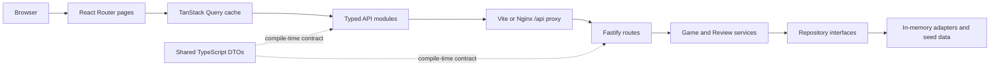

# Game Review

English | [Bahasa Indonesia](README.id.md)

## 1. Overview

Game Review is a small full-stack application for browsing a seeded game catalogue, reading player reviews, and submitting a review with a name, text, and rating from 1 to 5. The frontend and backend are separate TypeScript applications connected through a REST API.

The repository favors explicit boundaries over framework ceremony: React renders the browser experience, TanStack Query owns server state, Fastify exposes transport endpoints, services contain use-case rules, and replaceable repositories own persistence. Data is intentionally stored in memory, so no external database is required.

## 2. Requirement Coverage

| Requirement                       | Implementation                                                                                                    |
| --------------------------------- | ----------------------------------------------------------------------------------------------------------------- |
| Separate frontend and backend     | `apps/web` and `apps/api` communicate only through `/api` REST endpoints.                                         |
| Game and Review domain models     | Separate modules, services, and repository contracts live under `apps/api/src/modules`.                           |
| Seed data                         | Three games and three reviews are loaded into fresh in-memory repositories.                                       |
| Browse and inspect games          | `/` lists games; `/games/:gameId` shows details and reviews.                                                      |
| Submit validated reviews          | Browser and API validate required fields; the service enforces trimmed lengths and integer ratings from 1 to 5.   |
| Review visibility without restart | The submitter sees the server-confirmed review immediately; another active detail viewer polls every two seconds. |
| Automated verification            | Vitest covers backend services/routes and frontend behavior; Playwright covers the critical user flow.            |
| One-command reviewer environment  | `docker compose up --build` builds and starts the complete application.                                           |

## 3. Screens and Main Flow

The catalogue at `/` shows each game's title, platform, and genre, with loading, failure, and retry states. Selecting **Lihat detail** opens `/games/:gameId`, which shows the description, metadata, existing reviews, and an accessible review form.

The main flow is:

1. Open the catalogue and choose a game.
2. Read reviews ordered newest first.
3. Enter a reviewer name and review text, then choose a 1–5 rating using mouse or keyboard.
4. Submit the form. After the API returns `201`, the new review is inserted at the top of the local query cache without a page reload.
5. Other active viewers receive the review on the next two-second poll.

## 4. Architecture Diagram



HTTP handlers translate transport data and delegate to services. Services validate domain invariants and depend on repository interfaces rather than storage details. `packages/contracts` shares public DTO shapes between browser and API without importing backend business logic.

## 5. Project Structure

```text
apps/
  api/                 Fastify composition, routes, services, repositories, seeds
    src/modules/       Game and Review domain boundaries
    test/              Service, repository, server, and HTTP integration tests
  web/                 React/Vite single-page application
    src/api/           Relative-URL HTTP client and endpoint modules
    src/queries/       Query keys, cache policy, polling, and mutations
    src/pages/         Catalogue and game detail routes
    src/components/    Game cards, review list, form, and rating control
    test/              Component and client/query behavior tests
packages/contracts/    Shared REST DTOs and public error envelope
e2e/                   Playwright acceptance flow
compose.yaml           Complete local reviewer environment
```

## 6. Quick Start with Docker

Prerequisite: Docker with Compose v2.

```bash
docker compose up --build
```

Open <http://localhost:8080>. The API is also exposed at <http://localhost:3000>, and its liveness endpoint is <http://localhost:3000/health>. Compose waits for the API health check before starting the web service. Stop and remove the containers with:

```bash
docker compose down
```

The API image runs Node.js 24. The web image builds with Node.js 24 and serves static assets through Nginx, including SPA fallback and `/api` proxying.

## 7. Local Development

Prerequisites are Node.js 24 and Corepack. The root `packageManager` field pins pnpm 11.19.0.

```bash
corepack enable
corepack pnpm install --frozen-lockfile
pnpm dev
```

Open <http://localhost:5173>. Vite proxies `/api` to the API at `http://localhost:3000`. To run one side independently:

```bash
pnpm --filter @game-review/api dev
pnpm --filter @game-review/web dev
```

Do not put secrets in the repository. The current application needs no `.env` file; `PORT` optionally changes the API port, whose default is `3000`.

## 8. Running Tests

```bash
pnpm lint       # ESLint plus Prettier check
pnpm typecheck  # strict TypeScript checks in every workspace package
pnpm test       # all Vitest service, HTTP, and UI suites
pnpm build      # production builds for all packages
```

Run a focused suite while developing:

```bash
pnpm --filter @game-review/api test
pnpm --filter @game-review/web test
```

Install Chromium once, then run the browser acceptance test with ports `3000` and `4173` available:

```bash
pnpm test:e2e:install
pnpm test:e2e
```

Playwright starts real API and Vite processes and deliberately refuses to reuse existing servers, preventing a stale process from producing a false positive.

## 9. REST API

| Method | Path                         | Success | Purpose                       |
| ------ | ---------------------------- | ------- | ----------------------------- |
| `GET`  | `/health`                    | `200`   | Return `{ "status": "ok" }`.  |
| `GET`  | `/api/games`                 | `200`   | List seeded games.            |
| `GET`  | `/api/games/:gameId`         | `200`   | Return one game.              |
| `GET`  | `/api/games/:gameId/reviews` | `200`   | List reviews newest first.    |
| `POST` | `/api/games/:gameId/reviews` | `201`   | Validate and create a review. |

Example request:

```bash
curl -X POST http://localhost:3000/api/games/elden-ring/reviews \
  -H 'content-type: application/json' \
  -d '{"reviewerName":"Raka","text":"Exploration feels rewarding.","rating":5}'
```

`reviewerName` must contain 1–80 characters after trimming, `text` 1–2000 characters, and `rating` must be an integer from 1 to 5. Unknown game IDs return `GAME_NOT_FOUND`, invalid requests return `VALIDATION_ERROR`, unknown routes return `NOT_FOUND`, and unexpected failures return a sanitized `INTERNAL_ERROR` envelope.

## 10. Architectural Decisions

### Node.js 24 LTS vs Bun

- **Use case / requirement:** A reproducible backend runtime that reviewers can install or build in Docker with minimal surprises.
- **Decision:** Use Node.js 24 LTS, pinned by `engines`, `.nvmrc`, and both Dockerfiles.
- **Why it fits this project:** This assessment is optimized for evaluator reproducibility, mature Fastify/Node support, conventional test/build behavior, and minimal environment-specific variables.
- **Alternatives considered:** Bun, which is capable and attractive for its integrated tooling and runtime speed.
- **Why alternatives were not selected now:** Runtime and install speed offer little practical benefit at this scale compared with keeping the evaluator path conventional. Bun is not considered inferior or unsafe.
- **When the decision should be revisited:** Bun would be reconsidered where integrated tooling/runtime performance produces measurable benefit in a controlled deployment environment.

### React + Vite vs Next.js

- **Use case / requirement:** A responsive client-side catalogue and review flow consuming a separate REST API.
- **Decision:** Use React with Vite and React Router.
- **Why it fits this project:** Fast development/build feedback and an explicit SPA/API boundary match the requirements without a server-rendering layer.
- **Alternatives considered:** Next.js and its routing, server rendering, and full-stack conventions.
- **Why alternatives were not selected now:** SSR, SEO-specific rendering, and framework server features are not requirements and would duplicate the deliberately separate backend.
- **When the decision should be revisited:** Revisit if public discovery, server-rendered performance, or React server features become product requirements.

### TanStack Query vs native fetch/custom hooks

- **Use case / requirement:** Coordinate loading, errors, caching, mutation updates, retry behavior, and bounded polling across screens.
- **Decision:** Put server state in TanStack Query and keep HTTP calls behind small API modules.
- **Why it fits this project:** Stable query keys, observer-scoped polling, cancellation, retry policy, and post-mutation cache updates are explicit and testable.
- **Alternatives considered:** Direct `fetch` in components or bespoke fetching hooks.
- **Why alternatives were not selected now:** They would require recreating cache lifecycle and concurrency behavior that TanStack Query already expresses consistently.
- **When the decision should be revisited:** Remove it for a static or single-request UI; reconsider cache policy if the application adopts streaming updates or much larger datasets.

### React local state vs Redux/Zustand

- **Use case / requirement:** Manage review form fields and transient validation messages while sharing server data.
- **Decision:** Keep transient form/UI state local to React components; keep server data in TanStack Query.
- **Why it fits this project:** There is no meaningful shared client-state problem. Each form has a clear owner, while query data is already shared through the query cache.
- **Alternatives considered:** Redux and Zustand were considered but intentionally excluded.
- **Why alternatives were not selected now:** Adding a store solely to demonstrate familiarity would increase conceptual surface area without solving a requirement.
- **When the decision should be revisited:** Add a client store when genuinely cross-cutting client-only workflows emerge, such as a multi-screen draft, complex session state, or undo history.

### Fastify vs Express/NestJS

- **Use case / requirement:** A small typed REST API with predictable lifecycle, error mapping, injection testing, and low ceremony.
- **Decision:** Use Fastify with route plugins and separately constructed services/repositories.
- **Why it fits this project:** Fastify offers a focused plugin model, first-class `inject()` testing, and a straightforward production server boundary.
- **Alternatives considered:** Express for minimal routing and NestJS for a batteries-included application framework.
- **Why alternatives were not selected now:** Express would need more local conventions for the same test/error boundaries; NestJS introduces modules and dependency-injection ceremony beyond this application's needs.
- **When the decision should be revisited:** Consider Express when matching an existing estate, or NestJS when a larger team benefits from its standardized modules and cross-cutting infrastructure.

### Zod vs Fastify JSON Schema/TypeBox

- **Use case / requirement:** Validate review payloads at runtime and return structured field issues.
- **Decision:** Parse HTTP input with Zod and repeat critical invariants in the service boundary.
- **Why it fits this project:** The schema is concise, produces useful paths/messages, and keeps service calls safe even when invoked outside HTTP.
- **Alternatives considered:** Fastify JSON Schema with TypeBox for schema-driven validation, typing, and possible serialization benefits.
- **Why alternatives were not selected now:** The API has one write payload, so introducing another schema/type layer would add setup without meaningful payoff.
- **When the decision should be revisited:** Revisit when OpenAPI generation, many endpoints, response serialization, or schema reuse across clients becomes important.

### In-memory repository vs SQLite/PostgreSQL

- **Use case / requirement:** Seed data and accept new reviews without an external database.
- **Decision:** Use repository interfaces backed by defensive-copy in-memory adapters.
- **Why it fits this project:** Startup is deterministic, reviewer setup has no migration step, and services remain independent of a future storage technology.
- **Alternatives considered:** SQLite for local persistence and PostgreSQL for production concurrency and durability.
- **Why alternatives were not selected now:** External persistence is explicitly out of scope, and either option adds schema, migration, and operational concerns not needed to demonstrate the use cases.
- **When the decision should be revisited:** Replace the adapters when reviews must survive restarts, multiple API instances must share data, or querying/pagination requirements grow.

### Vitest + RTL + Fastify inject + Playwright

- **Use case / requirement:** Fast feedback on domain behavior, HTTP contracts, browser behavior, and one critical end-to-end journey.
- **Decision:** Use Vitest for package tests, React Testing Library for user-visible UI behavior, Fastify `inject()` for HTTP integration, and Playwright for browse-to-submit acceptance.
- **Why it fits this project:** Most failures are isolated quickly without network processes, while one real-browser path verifies that the assembled applications communicate correctly.
- **Alternatives considered:** Jest, browser-only testing, or a larger Playwright suite.
- **Why alternatives were not selected now:** Jest would add a second toolchain; browser-only tests are slower and less diagnostic; broader E2E coverage would duplicate cheaper behavior tests.
- **When the decision should be revisited:** Expand Playwright for high-risk cross-service journeys, and add coverage thresholds only when the team agrees on useful risk-based targets.

### Docker Compose

- **Use case / requirement:** Build and start the complete system with one reviewer command.
- **Decision:** Build separate multi-stage API and web images and orchestrate them with Docker Compose.
- **Why it fits this project:** Compose captures runtime versions, networking, API health ordering, Nginx SPA fallback, and same-origin API proxying in a reproducible path.
- **Alternatives considered:** Host-only scripts, one combined container, or a cluster orchestrator such as Kubernetes.
- **Why alternatives were not selected now:** Host scripts expose more machine variance, a combined image blurs deployable boundaries, and cluster orchestration is disproportionate for two local services.
- **When the decision should be revisited:** Adopt deployment-specific orchestration when production scaling, secrets, rolling releases, or managed health policies are required.

### Queues and Redis

- **Use case / requirement:** Create a review through a synchronous request/response flow and make it visible in a single-process, in-memory deployment.
- **Decision:** Do not add a message queue or Redis for the current scope.
- **Why it fits this project:** Review creation completes inside one API request. There are no durable background jobs, asynchronous retries, backpressure, cross-instance coordination, or cache-pressure requirements.
- **Alternatives considered:** Redis for distributed caching, rate limiting, or sessions, and a durable queue for background processing.
- **Why alternatives were not selected now:** Either would add deployment, failure-mode, monitoring, and data-lifecycle complexity without solving a present requirement.
- **When the decision should be revisited:** Revisit when the system needs durable background work, retry/backpressure control, multi-instance coordination, distributed caching/rate limiting/sessions, or measured load that justifies the operational cost.

## 11. Testing Strategy

Development follows red-green-refactor TDD. Service tests protect business rules and repository isolation; Fastify integration tests protect statuses, DTOs, persistence within one process, and sanitized error envelopes. React Testing Library covers visible loading/error/success states, validation, keyboard rating selection, cache races, and polling lifecycle. Playwright verifies catalogue → detail → submit → persisted review against real servers without reloading the page.

The primary release gates are `pnpm lint`, `pnpm typecheck`, `pnpm test`, and `pnpm build`. The E2E flow is a separate, higher-cost acceptance check. There is currently no arbitrary line-coverage target; tests are selected around requirements, boundaries, failure paths, and regressions rather than implementation details.

## 12. Assumptions

- This is a single-process assessment application with a small, trusted dataset and no account system.
- Review visibility for another user may lag by up to two seconds; polling runs only while the detail query has an active observer and does not continue in a background tab.
- A successful POST is authoritative. The submitter's cache is updated only after the server responds, then later polls reconcile it with server state.
- Browser requests use relative `/api` paths; Vite handles them locally and Nginx handles them in Docker.
- Seed records are recreated whenever a new application process starts.

## 13. Trade-offs

- In-memory persistence gives zero-setup reproducibility but no durability or horizontal scaling.
- Two-second polling is simple and bounded but creates repeated reads and is not truly real-time.
- Runtime validation at both route and service boundaries duplicates a few rules, but preserves domain safety for non-HTTP callers.
- Shared TypeScript DTOs prevent many compile-time mismatches, but they do not generate runtime clients or guarantee that an independently deployed service matches the client version.
- Immediate cache insertion gives responsive post-submit feedback, but concurrency still requires cancellation and ID-based deduplication to avoid stale GET results replacing the new review.
- A focused SPA avoids SSR complexity, but it does not optimize public SEO or first response rendering.

## 14. What I Would Improve with More Time

1. Add SQLite or PostgreSQL adapters, migrations, pagination, and integration tests against the selected database.
2. Replace polling with server-sent events for lower-latency review updates while retaining query-cache reconciliation.
3. Add authentication, ownership, moderation, rate limiting, and abuse controls before accepting public content.
4. Generate OpenAPI documentation and a typed client from runtime schemas to strengthen deployment-time contract checks.
5. Add structured logs, request correlation, metrics, production readiness probes, and error reporting.
6. Extend Playwright to failure/retry and multi-viewer scenarios, plus automated accessibility and visual-regression checks.
7. Add deployment smoke tests, scheduled dependency checks, and a separately triggered E2E release workflow when their runtime cost is justified.

## 15. Known Limitations

- Reviews disappear on API restart and are not shared across multiple API processes.
- There is no authentication, authorization, moderation, edit/delete flow, or duplicate/spam protection.
- Reviews have no pagination, aggregate score, search, sort controls, or user-configurable refresh behavior.
- Other viewers receive updates by polling, with up to a two-second foreground delay and no background-tab refresh.
- The UI intentionally has a compact catalogue and no game artwork, localization system, offline support, or SSR.
- Docker Compose is a reproducible local environment, not a production deployment specification.
